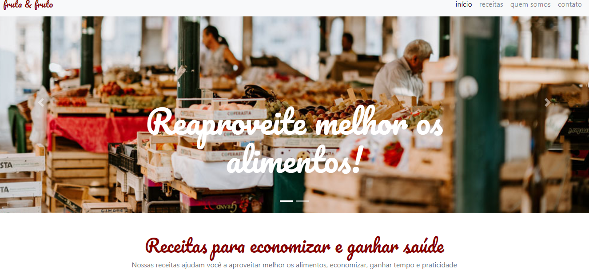

<h1 align="center">
    
🥝Fruta & Fruto - Bootstrap

</h1>

<h3 align="center">
    
📷screenshot

</h3>

## 📓Conteúdos

- 📁[Overview](#overview)
  - [Um pouco do projeto](#Um-pouco-do-projeto)
  - [Como rodar o projeto](#como-rodar-o-projeto)
  - [Como utilizar](#como-utilizar-o-projeto)
  - [Sobre](#Sobre)
- 📁[Processo](#processo)
  - [Tecnologia utilizadas](#tecnologias-utilizadas)
  - [O que eu aprendi](#oque-eu-aprendi)
  - [Continuação do desenvolvimento](#continuacao-do-desenvolvimento)
- 📁[Autor](#autor)

## 📜Overview

## 📍Um pouco do Projeto:

➡ Landing page simples de uma página de receitas focada no reaproveitamento de alimentos e na sua saúde

➡ Site feito com o auxilio do framework Bootstrap que é uma ferramenta gratuita para desenvolvimento HTML, CSS e JS.

### 📎Como rodar o projeto

 1. Primeiramente é necessário ter o node js instalado(caso não tenha, apenas baixe a pasta zip do projeto) 
 2. Clone o projeto com `git clone https://github.com/felipelopes12/site-receitas-bootstrap`
 3. Após clonar o projeto, basta apenas abrir o html principal do site e utilizar as suas funcionalidades

### 📎Como utilizar

 1. Se trata de uma landing page muito simples, então não possui muitas funcionalidades
 2. Ao clicar em contato no canto superior direito abre uma modal com um formulário para contato feito com o Bootstrap
 3. Possui um carrosel com 2 imagem trocando e posição e com seus títulos também feitos com o Bootstrap

## ✂ Sobre
Projeto criado com intuito de colocar em prática os conhecimentos do Bootstrap 4.

  - Manter o código limpo e bem feito seguindo as boas práticas do desenvolvimento HTML5, agilizando o desenvolvimento,
  - Utlização de componentes prontos de navbar, carrossel, cards e modais para criar sites responsivos automaticamente,
  - Utilização de método de desenvolvimento front-end para que suas aplicações sejam sempre responsivas, simples e funcionais independente do dispositivo,
  - Produção de um código HTML e CSS semântico e de qualidade para que leitores de tela e robôs de busca consigam ler bem o site e
  - Padronização dos componentes do site ou aplicação web.

## 💻Processo

### Tecnologias utilizadas:

### 📎O que eu aprendi
- O uso do framework Bootstrap 4
- Como encontar na documentação do framework e utilizar elementos como carrosel, css-grid, nav-bar e outros elementos do css
- Facilidade que o Bootstrap pode trazer para o projeto com o uso a todo momento da sua documentação

### 📎Continuação do desenvolvimento
- Continuar buscando outros estilos do Boostrap para usar no site
- Buscar mais informações de como usar versões mais recentes do framework

------
## 🖊️Autor

 Site desenvolvido por Amadeu Filipe Lopes 👋🏽 [Entre em contato!](mailto:felipe301016@hotmail.com)
⌨ 

- [ Linkedin](https://www.linkedin.com/in/amadeu-filipe-lopes12/)
- [GitHub](https://github.com/felipelopes12)
- [Instagram](https://www.instagram.com/felipe_lopes11/)

